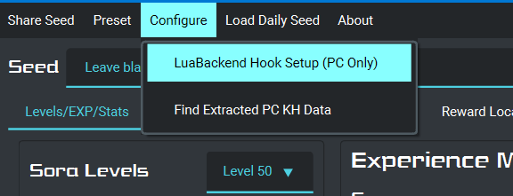
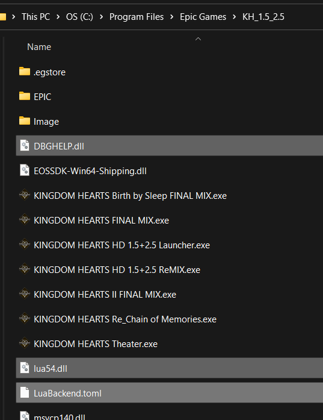

# LuaBackend Hook Setup

These instructions guide you through installing LuaBackend Hook and performing the necessary configuration for
integration with KH2 Randomizer using OpenKH Mods Manager. This integration allows mods to bundle their own Lua scripts,
giving several benefits:

* You can add, remove, enable, and disable Lua scripts the same way as other mods within Mods Manager.
* For mods that include Lua script(s) _as well as_ other game modifications, the script(s) will always be updated in
  tandem with the rest of the mod files, reducing the possibility for version mismatches.
* For mods that are _just_ a Lua script, you get the same one-click update feature you do for other mods.
* The seed generator may someday include Lua script(s) in the randomizer seed zip file.

## Option 1: Automatic setup (recommended)

Version 2.1.5 of the seed generator adds a screen to help you configure LuaBackend Hook automatically.

* Open the seed generator and choose `Configure -> LuaBackend Hook Setup (PC Only)`.



* On the LuaBackend Hook Setup screen, browse to the location where your OpenKH tools (such as Mods Manager) are
  located, and choose your intended Mod mode. This choice affects the name of the LuaBackend Hook DLL file.
  * Choose `Panacea (Mod Loader)` if you intend to use OpenKH Panacea to load mods without patching game files. Panacea
    uses `DBGHELP.dll` to hook into the game, and it knows to look for LuaBackend Hook's file with the name
    `LuaBackend.dll`.
  * Choose `Patch / Fast Patch` if you intend to patch your game files. In this configuration, LuaBackend Hook is named
    `DBGHELP.dll` itself.
* Choose `Check Configuration`.


* If you already have LuaBackend Hook installed, the files will all be found, but `Configuration File Status` may report
  that LuaBackend Hook is not yet configured for Mods Manager integration. If this is the case, you can just choose
  `Apply Configuration` to apply the necessary configuration.
* If any of the files are missing, or if you just want a fresh copy, choose `Download/Install/Configure` which will
  download, install, and configure a compatible version of LuaBackend Hook.

After you've configured LuaBackend Hook for Mods Manager integration, you can now take advantage of several common mods
with bundled scripts.

* Remove GoA ROM, auto save, and soft reset Lua scripts (if they exist) from your
  `Documents\KINGDOM HEARTS HD 1.5+2.5 ReMIX\scripts\kh2` folder. We'll manage these scripts via Mods Manager now. If
  you have other Lua scripts in this folder, you can still manage those manually. We just don't want duplicates.
* Make sure GoA ROM Edition is up-to-date in Mods Manager. GoA ROM bundles its Lua script in recent versions.
* Install `KH2FM-Mods-equations19/auto-save` and `KH2FM-Mods-equations19/soft-reset` in Mods Manager. The order for
  these two mods doesn't matter.


## Option 2: Manual setup

It's recommended to use the [automatic setup](#option-1-automatic-setup-recommended) option above, but below are
instructions on how to install and configure LuaBackend Hook manually, if needed.

### Installation

* Download the [DBGHELP.zip](https://github.com/Sirius902/LuaBackend/releases/latest/download/DBGHELP.zip) file.
* Copy the contents of `DBGHELP.zip` to your Games Install folder. This folder is usually located at
  `C:\Program Files\Epic Games\KH_1.5_2.5` and contains the game executables such as `KINGDOM HEARTS II FINAL MIX.exe`. 
  * If you're using OpenKH Panacea to load mods without patching, make sure to rename LuaBackend Hook's `DBGHELP.dll`
    file to `LuaBackend.dll` so that you don't overwrite Panacea's `DBGHELP.dll`.
  * If you're not using OpenKH Panacea, LuaBackend Hook's `DBGHELP.dll` does not need to be renamed.
* Once you've copied the files there, the folder should look something like this (with the possibility for
  `LuaBackend.dll` to also be there as described above).



### Configuration

* Open the `LuaBackend.toml` file in Notepad or another text editor. The top of the `kh2` section should look something
  like this when you start:

```
[kh2]
scripts = [{ path = "scripts/kh2/", relative = true }]
```

* Edit this section to add the location of your OpenKH installation (adding `/mod/scripts` at the end) as an
  additional location for scripts. For example, if you have OpenKH installed at `C:\kh2rando\openkh`, edit the `scripts`
  part of the `kh2` section to look like the following (the forward slashes rather than backslashes are important):

```
[kh2]
scripts = [
    { path = "scripts/kh2/", relative = true },
    { path = "C:/kh2rando/openkh/mod/scripts", relative = false }
]
```

After you've configured LuaBackend Hook for Mods Manager integration, you can now take advantage of several common mods
with bundled scripts.

* Remove GoA ROM, auto save, and soft reset Lua scripts (if they exist) from your
  `Documents\KINGDOM HEARTS HD 1.5+2.5 ReMIX\scripts\kh2` folder. We'll manage these scripts via Mods Manager now. If
  you have other Lua scripts in this folder, you can still manage those manually. We just don't want duplicates.
* Make sure GoA ROM Edition is up-to-date in Mods Manager. GoA ROM bundles its Lua script in recent versions.
* Install `KH2FM-Mods-equations19/auto-save` and `KH2FM-Mods-equations19/soft-reset` in Mods Manager. The order for
  these two mods doesn't matter.


